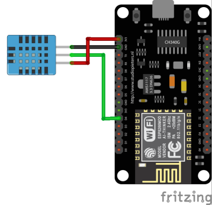

## Cusomt IoT Sensor Device

This is an Arduino project running on a NodeMCU reading temperature and humidity data from a DHT11 sensor.

.

Before uploading the Arduino sketch, make sure to update **WIFI connection info** and the **Azure IoT device connection string** accordingly.

```c++
//
// TODO: set these values before uploading the sketch
//
#define IOT_CONFIG_WIFI_SSID            ""
#define IOT_CONFIG_WIFI_PASSWORD        ""
#define IOT_CONFIG_CONNECTION_STRING    ""

```
