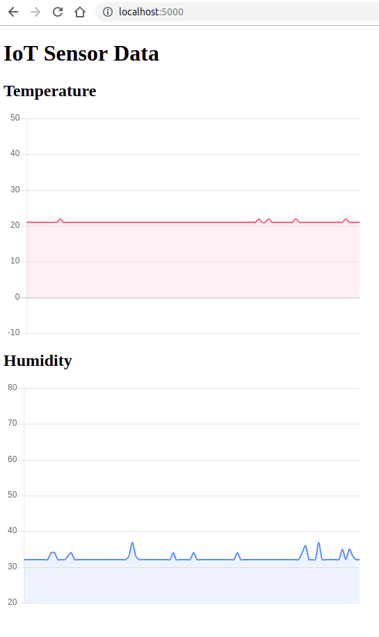

# Iot Data Visualization

This is an ASP.NET Core MCV application that visualizes the IoT data sent by the custom sensor device.

Before starting the application, these constants have to be set in order to connect to an Azure IoT hub.

```csharp
public class IoTHubEventsReader
{
  . . .
  private const string EventHubsCompatibleEndpoint = "";
  private const string EventHubsCompatiblePath = "";
  private const string IotHubSasKey = "";
  . . .
```

The application is built using:
* [Microsoft.Azure.EventHubs](https://www.nuget.org/packages/Microsoft.Azure.EventHubs/)
* ASP.NET Core SignalR
* [Chart.js](https://chartjs.org)


